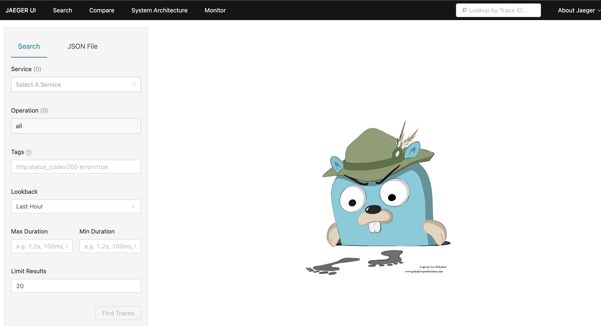
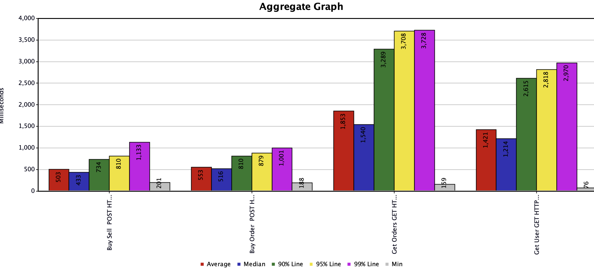

# Brokerage Provider API

## Intent
Brokerage Provider API project represents simulates a brokerage provider.

## Designing the Brokerage Provider API


### Perspective

- The project design works with docker containers by using docker compose (all system items works with the docker)
- The project programming language is Python. Services coded with Python programming language.
- Rest API framework is FastAPI (https://fastapi.tiangolo.com/). Swagger and OpenAPI documentation are automatically generated with FastAPI.
- Storing of data uses PostgreSQL database
- Kafka uses for messaging queue 
- Redis uses for caching
- The API works with HTTP requests
- User service manages user operations and write/read data to PostgreSQL database. 
- Stock service manages stock operations and write/read data to PostgreSQL database. The service provides adding new stocks for using of the API. 
(If you add stock before creating a new user. Service add existing stocks to user with default configuration.)
- Order service manages order operations. The service send event messages to Kafka Queue with kafka producer python library.
- Order consumer service manages kafka order queue messages and the service writes order event to database with business logics. 
After database operations, The service sends notification events to kafka notification queue.
- Notification service manages kafka notification queue messages and the service sends notifications to client with telegram.

### Assumptions
- The project assumes that Authorization and Authentication requirements were provided.
- The project assumes no need for Load Balancing.
- Order Consumer Service and Notification Service are different services from Brokerage Provider API, 
but The services stores same repository for the project. 
Order Consumer Service location is **src/infra/adapter/consumer/kafka/order/order_consumer.py** path. 
Notification Service location is **src/infra/adapter/consumer/kafka/notification/notification_consumer.py** path.
- The project assumes no need for Data Sharding and Partitioning.
- The project assumes no need for database backup.
- The project assumes no need for third party logging provider and storing of log data
(The project creates logs for all steps, but service logs deleting after close down the containers.).
- User and stock database can use different databases for microservice architecture. The project assumes no need different databases because of works with small data.

### Service Details
- The API includes health check endpoint
- The API includes exception handling (src/api/handler/exception_handler.py)
- The project includes monitoring system with Prometheus and Grafana.
- The project includes tracing system with opentracing and JAEGER
- The project includes swagger UI and openapi documentation
- The project includes kafka visualization UI with Kafdrop
- pre commit hook uses for formatting, code styling, and static typing (black, flake8, and mypy)
- While coding, attention was paid to clean code principle, DRY, KISS and SOLID principles.
- pytest library uses for testing
- The API includes version structure for HTTP requests
- Dependency Injection uses service between adapters.
- Database connections manages with ORM (Sqlalchemy python library)
- Logging manages with python logging package as singleton configuration
- Database connection works with singleton design pattern principle
- Error handling works with integer error codes. Error messages are in **src/infra/util/errors.py:1**


## Building and running the application
**From the project directory**;

Copy default environment variables to .env
```bash
cp default.env .env
```

**Optional** | Required variables already set. If you want to recieve telegram notifications, should set below variables. 
Should run resources/notification_telegram_get_chat_ids.py file for NOTIFICATION_TELEGRAM_CHAT_ID variable. 
```bash
NOTIFICATION_TELEGRAM_BOT_TOKEN=
NOTIFICATION_TELEGRAM_CHAT_ID=
```

Run below command to **run** the application
```bash
docker-compose up --build
```

Run below command to **test** the application
````bash
docker-compose -f docker-compose.yml run tests
````

## Using of Service
- First, In order to buy, sell, cancel order, stock must be added from the **api/v1/stocks** (http://localhost:8000/#/stock/create_stock_api_v1_stocks_post) url.
- Second, In order to buy, sell, cancel order, user must be added from the **api/v1/users** (http://localhost:8000/#/user/create_user_api_v1_users_post) url.
- After 2 step, can test every features
- **Data models are available on Swagger UI**


### Swagger UI 
- **URL :** http://localhost:8000/
- **Openapi document URL :** http://localhost:8000/openapi.json
- The project can manually test on swagger UI
- Endpoints request and response models are available on swagger UI


### Database Structure
- Database migration manages with alembic python library
- Migration versions are in the **migrations/versions** folder


### Test Coverage of Project
- Test files are in tests folder. Also, you can reach test coverage report  after running of tests from **coverage-reports/coverage-api.html/index.html** file


### Monitoring of Project with Prometheus and Grafana
**Prometheus**
- **URL :** http://localhost:9090/


**Grafana**
- **URL :** http://localhost:3000/
- UI Credentials;  username: **admin** password: **admin**
- Should import **resources/grafana-dashboard.json** file to Grafana import dashboard section for Brokerage Provider API.


### Virtualization of Kafka Events with Kafdrop
- **URL :** http://localhost:9000/
- Can be viewed stream orders on Kafdrop


### Tracing of Project with Jaeger
- **URL :** http://localhost:16686/




### Client Order Event Notification at Telegram
- **URL :** http://localhost:16686/


### Stress Test with Jmeter for Service
- Test scenario worked with 2 get (user (the endpoint includes user stock data) and orders) 2 post request (buy order and  sell order). 
- Test scenario file is **resources/brokerage-provider-api-load-stress-test.jmx**

About Result of Stress Testing
- **Weakness 1 -** post endpoints add new data to database in test, So if you list orders response data are increasing every second. For the case list, paging should add order listing endpoint. 
Note: If you request to list orders endpoint without create order endpoint, response time performance can be regular

Summary Report


Response Time Graph


Aggregate Graph



Grafana Dashboard 


